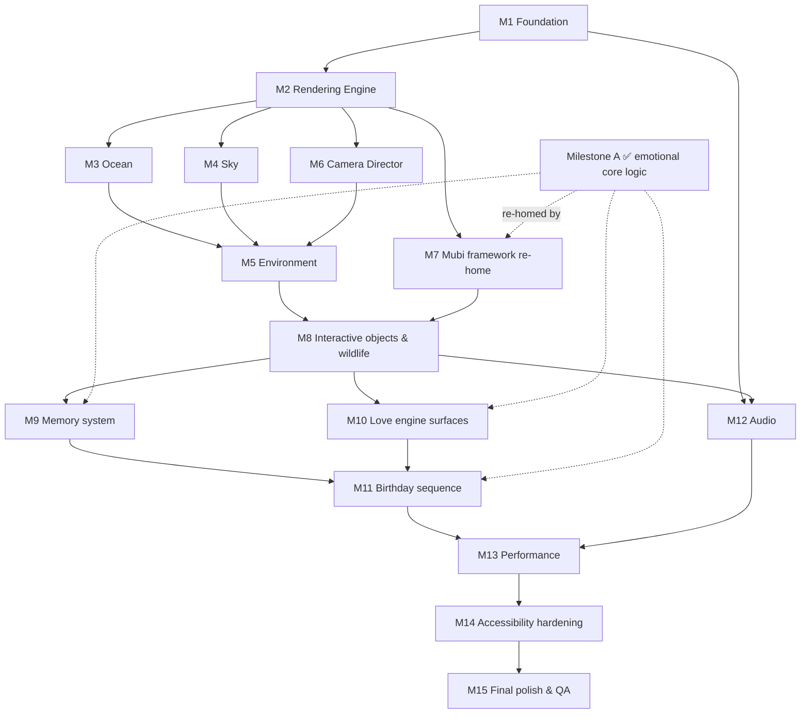
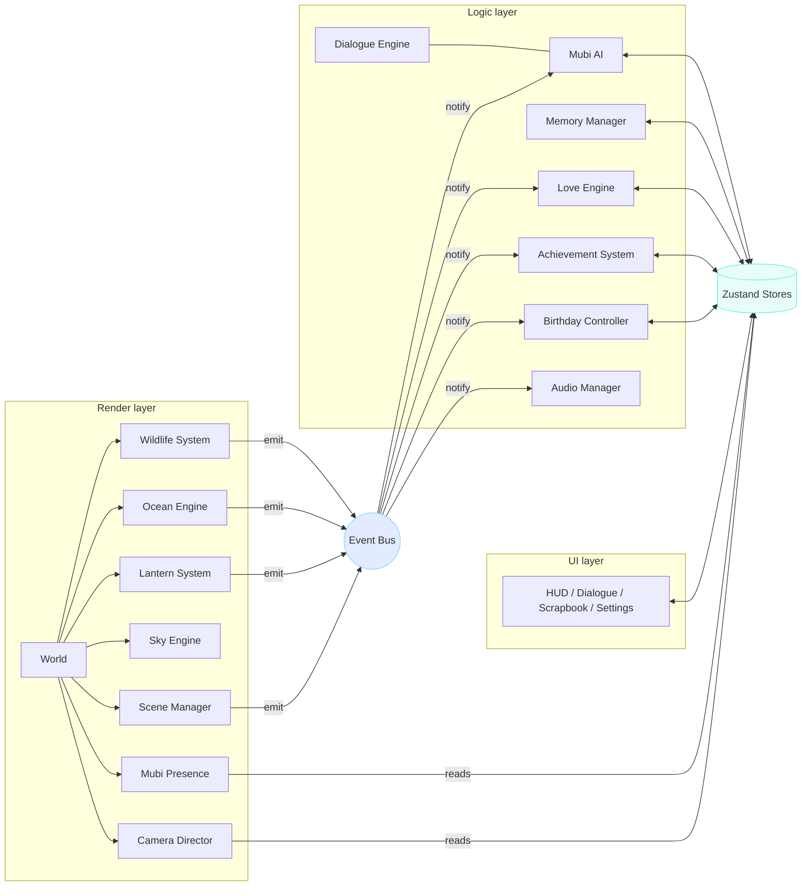

# 🧭 Sea of Stars — Master Implementation Plan

> **Status:** Canonical engineering execution plan. This is the authoritative
> build strategy; it supersedes the lighter `IMPLEMENTATION_ROADMAP.md` (kept as
> a quick index). It **implements** — and never contradicts — the frozen
> specification: Part 1 (vision/Part 1 code), Part 2
> ([Blueprint](ENGINEERING_BLUEPRINT.md)), Part 3
> ([World Design](WORLD_DESIGN.md)), Part 4 ([Mubi](MUBI_AI.md)), Part 5
> ([Emotional Systems](EMOTIONAL_SYSTEMS.md)).
>
> **Planning only — no production application code.**

---

## 0. Reconciliation & the one sequencing trade-off (read first)

The specs are frozen. The brief's suggested build order (rendering → … → Mubi at
7 → memory 9 → love 10 → birthday 11) assumes those emotional systems are built
*after* the render engine. **They are already built** as **render-agnostic logic
modules** in the shipped **Milestone A** (see `ADR-0002`): stores, versioned
save, the Love/warmth engine, the dialogue engine + Mubi controller, memory,
achievements, and the birthday flow — all wired onto Part 1's working world.

**Improvement to the order (not a spec change):** because that logic exists and
is decoupled from rendering, the remaining plan is primarily **(a)** a render
engine migration and **(b)** *re-homing + expanding* the emotional systems into
it, rather than building them from zero. This reduces risk (the hard, emotional
logic is done and tested) and lets the render migration proceed behind a stable
logic layer.

> **Trade-off stated plainly:** we keep the shipped emotional core on the
> current renderer until the R3F engine (M2) reaches parity, then re-home it in
> one controlled move. The alternative — freezing feature work to migrate first —
> was rejected in ADR-0002 as higher-risk with no emotional payoff. No canonical
> document changes; only sequencing is optimized.

Milestone status carried forward: **M0/M1 partially done, Milestone A (emotional
core) done.** Everything below marks `✅ done · 🟡 partial · ⏳ planned`.

---

## 1. Development rules (the contract every milestone obeys)

Extends Blueprint §20. Non-negotiable:

1. **No duplicated logic.** One rotation engine for all content (Mubi + Love),
   one wind/flow field, one Camera Director, one save path.
2. **Reusable components only.** Feature-local first; promote to shared only when
   used twice. Small public `index.ts` per feature; no deep imports.
3. **Strong typing.** `strict` TS, **no `any`** in committed code; public
   surfaces are `interface`/`type` contracts.
4. **Feature-first organization** (Blueprint §5). No cross-scene imports; systems
   talk only through stores + the event bus.
5. **Three-layer separation** (UI / Logic / Render). No layer reaches into
   another's internals.
6. **Accessibility by default.** Every feature ships its reduced-motion path,
   caption/text equivalent, keyboard route, and photosensitivity cap *in the
   same PR* — never as a later pass.
7. **Lazy loading where appropriate.** Code-split per scene; heavy assets,
   audio, galleries, celebration assets load on demand.
8. **No unnecessary dependencies.** Justify every new package against bundle cost
   (Blueprint §13). Prefer the platform.
9. **Consistent animation philosophy** (Blueprint §9): Framer=UI, Lenis=scroll,
   GSAP=scripted timelines, `useFrame`=world. Never mix within a layer; never
   `setState` per frame.
10. **Dispose what you create.** GPU resource ownership = creator; released on
    unmount.
11. **Preserve emotional storytelling.** Every change is measured against "does
    Mubarra feel more loved?" A technically better solution that dims the feeling
    is the wrong solution.
12. **Every render-touching PR records** a frame-time + bundle-size measurement.

---

## 2. Improved dependency graph

**Why this differs from the naive linear order:**
- **Camera (M6)** depends only on the render engine, so it's built alongside
  Ocean/Sky, not after Environment — the world is composed *through* the camera.
- **Audio (M12)** has a *foundation* seeded early (Milestone A ships procedural
  audio) but its rich, spatial, per-scene form depends on Interactive objects
  (M8) existing to attach spatial sources to — so full audio lands after M8, in
  parallel with later work rather than blocking it.
- **Mubi/Memory/Love/Birthday (M7–M11)** are **re-integration + content
  expansion** of shipped logic, not greenfield — lower risk, and they can begin
  as soon as the render engine (M2) is stable.

---

## 3. Milestones

Each milestone: **Goal · Components · Dependencies · Complexity · Risks ·
Testing · Exit criteria.** Complexity scale: Low / Medium / High / Very High.

### M1 — Project foundation 🟡
- **Goal:** the maintainable skeleton — the `src/` feature-first tree
  (Blueprint §5), Tailwind, ESLint boundary rules, the test harness (Vitest +
  the Playwright screenshot/visual harness already in `tooling/`), capability
  tiering service, and the shared event bus + store scaffold. Move the shipped
  `lib/` logic into `src/` in one pass.
- **Components:** app-shell, `stores/`, `services/` (Capability, Storage,
  AssetManager stub, EventBus), `constants/`, `types/`, test tooling.
- **Dependencies:** none (builds on existing repo).
- **Complexity:** Medium.
- **Risks:** import churn during the `lib/→src/` move; alias breakage.
- **Testing:** unit (stores, save, capability classifier, event bus); build +
  typecheck gate; harness smoke run.
- **Exit criteria:** clean build/typecheck; existing Milestone A behavior
  unchanged (visual harness green); ESLint boundary rule active.

### M2 — Rendering engine (R3F) ⏳
- **Goal:** port Part 1's vanilla-Three world to React Three Fiber — one
  persistent `<Canvas>`, `WorldLayer` + `SceneManager` shells, selective bloom
  via `@react-three/postprocessing`, `AdaptiveDpr` + `PerformanceMonitor` tiers.
  **Preserve every GLSL string** (ADR-0001).
- **Components:** `app-shell/WorldCanvas`, `world/postfx`, `scenes/SceneManager`,
  `world/camera/CameraRig`, `WebGLErrorBoundary`.
- **Dependencies:** M1.
- **Complexity:** High.
- **Risks:** R3F/Next 16/React 19 interop; context-loss handling; bloom parity
  (Part 1's white-out lesson); frame-loop regressions.
- **Testing:** visual regression vs Part 1 baselines (the migration gate);
  shader compile smoke tests; frame-time capture on mid-tier profile.
- **Exit criteria:** the Shore scene matches Part 1 baselines frame-for-frame at
  60 FPS mid-tier; context-loss falls back gracefully.

### M3 — Ocean system ⏳
- **Goal:** ocean as R3F component; upgrade to the **trail render-target**
  (touch ripples + persistent wake trails), SSS + caustics, tiered octaves,
  moon-reflection modes; per-scene `worldProfile` moods.
- **Components:** `world/ocean/*`, trail-RT ping-pong, `world/weather` wind-field
  uniform hook.
- **Dependencies:** M2.
- **Complexity:** High.
- **Risks:** RT cost on mobile; trail persistence vs memory; grazing-angle
  artifacts.
- **Testing:** perf on low/mid tiers; visual regression of ripple/trail; unit
  for wind-field math.
- **Exit criteria:** ocean holds 60 FPS across all `worldProfile`s on mid-tier;
  trails read correctly; degrades cleanly on `low`.

### M4 — Sky system ⏳
- **Goal:** parallax star layers ("perceptual millions"), twinkle/drift, shooting
  stars + meteor showers, subtle aurora, the **constellation hook** (for memory
  timeline & birthday).
- **Components:** `world/sky/*`.
- **Dependencies:** M2.
- **Complexity:** Medium.
- **Risks:** overdraw from additive layers; aurora over-brightness (WD §3
  lesson).
- **Testing:** perf (fill-rate); visual regression; unit for constellation
  target-set builder.
- **Exit criteria:** sky at 60 FPS with meteors; aurora subtle; constellation
  API ready for M9/M11.

### M5 — Environment ⏳
- **Goal:** the living, coherent atmosphere — **wind field + World Breath**
  uniforms shared by all systems, fog/mist, flora/butterflies/petals, lighting
  system (god-rays approximation, per-scene grade).
- **Components:** `world/weather`, `world/life` (flora), `world/postfx` (grade,
  god-rays).
- **Dependencies:** M3, M4, M6.
- **Complexity:** High.
- **Risks:** god-ray cost; billboard fog overdraw; coherence bugs across
  systems reading the field.
- **Testing:** perf; visual regression; unit for World Breath/wind signal.
- **Exit criteria:** one environment state drives ocean/flora/fog/light
  coherently at 60 FPS mid-tier.

### M6 — Camera Director ⏳
- **Goal:** the single camera authority — named cinematic timelines (drift,
  glide, reveal, tether, offer, focus-pull, celebration), pointer/tilt parallax,
  reduced-motion variants, transition-scene support (seamless, no loading
  screens → WD §13).
- **Components:** `world/camera/CameraDirector`, `animation/` timelines (GSAP).
- **Dependencies:** M2.
- **Complexity:** Medium.
- **Risks:** timeline/`useFrame` conflicts; motion sickness (mitigated by easing
  + reduced-motion).
- **Testing:** manual QA of feel; reduced-motion path; unit for timeline
  sequencing.
- **Exit criteria:** all camera motion flows through the Director; no scene
  moves the camera directly; reduced-motion fully supported.

### M7 — Mubi AI framework (re-home + expand) 🟡
- **Goal:** re-integrate the shipped Mubi controller/dialogue engine into the R3F
  world; add Mubi's **3D presence** (light/wisp entity reading `mubiStore`);
  expand content packs to the full **dialogue-category taxonomy** (Part 5 §1).
- **Components:** `ai/mubi/*` (shipped), `world/mubi` (presence), `ui/dialogue`
  (shipped `MubiDialogue`), content packs.
- **Dependencies:** M2 (render), reuses Milestone A logic.
- **Complexity:** Medium (logic exists; integration + content).
- **Risks:** presence↔dialogue sync; content volume/quality; no-repeat across
  sessions.
- **Testing:** unit (selector, guards, no-repeat — seeded RNG); integration
  (event→line→effect→store); manual QA of voice/timing; a11y (live region).
- **Exit criteria:** Mubi speaks from data across all categories with a synced 3D
  presence; reveal pacing intact; deterministic selection under seed.

### M8 — Interactive objects & wildlife ⏳
- **Goal:** the **interaction-grammar catalogue** (Part 5 §3) — wildlife
  (stylized cinematic realism, instancing/LOD/boids), lanterns (shipped logic →
  instanced), shells/hearts/pearls/treasure chests, and the unified
  wake/flow-field so life reacts to the visitor.
- **Components:** `world/life/*`, `world/particles` (boids), `features/
  interactions`, `features/collectibles`.
- **Dependencies:** M5 (environment/flow field), M7 (Discovery reactions).
- **Complexity:** Very High.
- **Risks:** draw-call/animation budget; boids cost; asset pipeline (glb/KTX2);
  interaction reliability across tiers.
- **Testing:** perf per creature/system; integration (interaction→event→Mubi/
  Love/achievement); manual QA; visual regression of key sightings.
- **Exit criteria:** all catalogued entities interactive with 4-facet feedback at
  60 FPS mid-tier; every interaction emits the correct events.

### M9 — Memory system ⏳
- **Goal:** the presentation layer (Part 5 §4) — constellation-timeline, floating
  memories rising from the deep, glass photo frames (shipped `RevealCard`
  extended), the **love scrapbook**, memory islands, secret memories.
- **Components:** `features/memories`, `ui/overlays` (scrapbook), reuses
  `collectibles` store + save.
- **Dependencies:** M8 (discovery), M4 (constellation), Milestone A data model.
- **Complexity:** High.
- **Risks:** photo asset loading (lazy); scrapbook state size; timeline layout.
- **Testing:** unit (unlock/persist/migration); integration (find→store→
  scrapbook); a11y (scrapbook is DOM, screen-reader retelling); visual
  regression.
- **Exit criteria:** memories discovered, framed, and revisitable; persist across
  reload; scrapbook fully accessible.

### M10 — Love engine surfaces ⏳
- **Goal:** integrate the **Love Message Library** (Part 5 §2) — the shared
  no-repeat rotation, rarity, delivery surfaces (shells/pearls/hearts/daily
  wish/Mubi), anniversary + seasonal packs.
- **Components:** `love/*` (library + rotation, reusing `ai/selector`),
  `features/collectibles` hooks, `content/` packs.
- **Dependencies:** M8 (surfaces exist), Milestone A warmth engine.
- **Complexity:** Medium.
- **Risks:** content authoring volume; date/season logic; ensuring no-repeat
  across surfaces + sessions.
- **Testing:** unit (rotation exhaustion guarantee, rarity weighting, date/season
  filters — seeded); integration (surface→message→seen-set persist).
- **Exit criteria:** 100+ messages rotate without repeat until exhausted; rarity
  feels rewarding; anniversary/seasonal swap correctly; all persisted.

### M11 — Birthday sequence ⏳
- **Goal:** the full choreography (Part 5 §6) — live countdown, midnight
  auto-transition, ocean-wide bioluminescence, balloons, quiet fireworks,
  confetti, cake, candle + wish, **final constellation reveal**, Mubi's final
  speech, letter, farewell.
- **Components:** `features/celebration` + `BirthdayController`, reuses
  Sky/Ocean/Camera/Mubi/Love.
- **Dependencies:** M9, M10 (+ M4/M6).
- **Complexity:** High.
- **Risks:** photosensitivity (hard cap, no strobe); perf spike of combined FX;
  timezone/date edge cases; replay/no-date fallbacks.
- **Testing:** integration (countdown→midnight→sequence→ending); perf under peak
  FX; a11y (captions, non-motion candle/wish, reduced-motion bloom); manual QA
  of the emotional peak.
- **Exit criteria:** full Intro→Birthday→Ending playable; safeguards verified;
  replayable; holds acceptable FPS during peak on mid-tier.

### M12 — Audio ⏳
- **Goal:** the layered spatial soundscape (WD §14) — bus graph, per-scene
  profiles + crossfades, spatialized creature/lantern/cave sources, ducking,
  World-Breath-linked swell; keep procedural score as fallback.
- **Components:** `audio/AudioEngine` + buses, per-scene `audioProfile`,
  `useAudioStore`.
- **Dependencies:** M1 (foundation), M8 (spatial sources to attach to).
- **Complexity:** High.
- **Risks:** mobile audio unlock/latency; stem loading weight; spatialization on
  small speakers.
- **Testing:** unit (bus math, crossfade, ducking); manual QA on device;
  a11y (mute/per-bus, captions); fallback when audio blocked.
- **Exit criteria:** each scene sounds distinct with smooth crossfades; spatial
  sources correct; degrades to procedural/silent gracefully.

### M13 — Performance optimization ⏳
- **Goal:** meet the budget everywhere (Blueprint §13) — dynamic resolution,
  instancing/LOD/boids tuning, KTX2/Draco compression, code-split audit, tier
  gating of rain/creatures/FX.
- **Components:** cross-cutting; `services/Capability`, `AssetManager`, all world
  systems.
- **Dependencies:** M11, M12 (full content to profile).
- **Complexity:** High.
- **Risks:** regressions from optimization; over-aggressive downscaling harming
  feel.
- **Testing:** frame-time + bundle-size regression suite; device-matrix
  profiling; memory-leak checks (dispose audit).
- **Exit criteria:** 60 FPS on the target modern-Android class across scenes;
  bundle within budget; no leaks over a full journey.

### M14 — Accessibility hardening ⏳
- **Goal:** verify and complete the a11y contract (Blueprint §14, WD, Part 5) —
  reduced-motion across all systems, keyboard, screen-reader retelling
  (scrapbook), captions, high-contrast, photosensitivity, adjustable sensitivity,
  skip/pause.
- **Components:** UI layer, settings, all features.
- **Dependencies:** M13 (stable systems).
- **Complexity:** Medium.
- **Risks:** gaps discovered late; motion in the 3D layer under reduced-motion.
- **Testing:** a11y audit (axe + manual SR pass); reduced-motion full-journey;
  photosensitivity review of every FX.
- **Exit criteria:** a11y checklist green; a complete reduced-motion + captioned
  journey; no strobing anywhere.

### M15 — Final polish & QA ⏳
- **Goal:** Awwwards-grade finish — motion/audio detailing, color grading,
  additional easter eggs, PWA/offline (Blueprint §16), and full QA.
- **Components:** all; `app/manifest`, service worker.
- **Dependencies:** M14.
- **Complexity:** Medium/High.
- **Risks:** scope creep; SW cache correctness; last-mile regressions.
- **Testing:** full device matrix; error-path verification; save-migration tests;
  offline/install; full-journey visual regression.
- **Exit criteria:** all gates green on the device matrix; installable + offline;
  graceful degradation proven end-to-end.

---

## 4. Component map (ownership & communication)

Three communication channels, and only three:
- **Stores** (Zustand slices) — discrete, meaningful state; read/written by any
  layer, subscribed by UI + controllers. Never per-frame values.
- **Event bus** (typed `WorldEvent` emitter) — fire-and-forget world events
  (ripple, lanternOpen, creatureSighting, sceneEnter). Decouples producers from
  consumers.
- **Refs / uniforms** — per-frame high-frequency values (camera, ocean uniforms).
  Never in stores.

| System | Layer | Owns / responsibility | Reads | Communicates via | Must NOT |
| --- | --- | --- | --- | --- | --- |
| **World** | Render | root composition, frame loop, tier | settings, world store | props, refs | hold gameplay logic |
| **Scene Manager** | Render | active scene lifecycle, transitions, streaming | scene store | event bus, Suspense | know a scene's internals |
| **Camera Director** | Render | all camera motion, timelines | scene/world store | refs, GSAP | be moved by scenes directly |
| **Ocean Engine** | Render | ocean sim, trail-RT, moods | world store, wind field | uniforms, emits ripple | store per-frame data |
| **Sky Engine** | Render | stars/moon/aurora/meteors/constellation | world store | uniforms | own gameplay state |
| **Wildlife System** | Render | creatures, boids, sightings | flow field, warmth | emits sighting events | drive dialogue itself |
| **Lantern System** | Render | lantern flock, carriers, release | collectibles, warmth | emits lanternOpen | own memory content |
| **Mubi AI** | Logic | context→line selection, effects, reveal | all stores (read) | writes mubi/progress; listens bus | render anything |
| **Dialogue Engine** | Logic | pack filtering, no-repeat, rarity | mubi memory | called by Mubi AI | contain story lore in code |
| **Memory Manager** | Logic | unlock/store/scrapbook/timeline | collectibles, save | writes stores | render UI |
| **Love Engine** | Logic | warmth model + message rotation | progress, save | serves surfaces via bus/calls | duplicate rotation code |
| **Audio Manager** | Logic | bus graph, profiles, spatial, ducking | audio store, bus | Web Audio graph | block visuals |
| **Achievement System** | Logic | evaluate/unlock/rewards | all stores | writes achievements; toasts via store | gate core progress |
| **Birthday Controller** | Logic | countdown, sequence orchestration | progress, save, date | drives camera/FX/Mubi via bus+calls | duplicate FX systems |
| **UI Layer** | UI (DOM) | HUD, dialogue, scrapbook, settings, cards | stores | stores, prompt callbacks | touch WebGL internals |

---

## 5. State flow

Six categories, each with a defined home. **Global state is avoided** by keeping
per-frame data in refs/uniforms and discrete state in narrow store slices.

| Category | Lives in | Persisted? | Written by | Read by | Notes |
| --- | --- | --- | --- | --- | --- |
| **Rendering state** | refs + shader uniforms | no | `useFrame`, systems | GPU | never in stores; camera/ocean/particle values |
| **Gameplay state** | `scene`, `progress`, `collectibles` stores | progress/collectibles: yes; scene: no | controllers, features | UI, controllers | act, warmth, flags, opened items |
| **Persistent memory** | save system (versioned) | yes | stores via `persist` → `StorageService` | on load / scrapbook | one schema, migration chain |
| **User preferences** | `settings` store | yes | settings UI | all layers | reduced-motion, contrast, captions, volumes |
| **AI state** | `mubi` store (+ controller) | only `spokenLineIds` | Mubi controller | dialogue UI, presence | live speech ephemeral; memory persisted |
| **Environmental state** | `world` store + uniforms | no | scene profiles, weather, World Breath | render systems | mood/palette/wind/breath; ephemeral |

**Flow example (touch → ripple):** pointer → Ocean writes trail-RT (uniform) +
emits `ripple` on the bus → Love Engine bumps `warmth` (store), Mubi AI may
`speak` (store), Achievement System may unlock (store) → UI re-renders from
store subscriptions. No global blob; each consumer reacts to the one event.

---

## 6. Performance plan (per major system)

Target: 60 FPS on modern Android (Blueprint §13). Tiers per Blueprint §17.

| System | Perf risk | Optimization | Mobile | Loading | Memory |
| --- | --- | --- | --- | --- | --- |
| **Ocean** | RT + octaves + fill | tiered octaves; capped RT res; clamped point sizes | fewer octaves, smaller RT | in initial world tier | dispose RTs on scene exit |
| **Sky** | additive overdraw | parallax layers not 1M verts; clamped sizes | fewer stars/meteors | world tier | static buffers |
| **Environment** | god-rays, fog overdraw | screen-space rays; billboard fog | rays off on `low` | with scene | shared field uniforms |
| **Wildlife** | draw calls, skeletal, boids | instancing, LOD, GPU boids, distant billboards | lower counts, low-LOD whales | lazy per scene | dispose per scene |
| **Lanterns** | many meshes/lights | instanced mesh, faked additive glow | fewer instances | with scene | shared materials |
| **Memory/photos** | image weight | lazy, responsive sizes, KTX2 where apt | progressive | on demand (galleries) | evict off-scene |
| **Birthday FX** | peak particle load | pooled GPU particles; capped counts | reduced counts, no strobe | preloaded at reveal | free after sequence |
| **Audio** | stems weight, latency | lazy stems; short SFX preloaded | unlock on gesture; fewer layers | per-scene profile | release unused buffers |
| **Mubi/Love/Memory logic** | negligible GPU | pure logic, seeded RNG | n/a | in bundle (small) | bounded ledgers |

Cross-cutting: `AdaptiveDpr` + `PerformanceMonitor` demote/promote tier live;
pause render on hidden tab (shipped); one wind/flow field to avoid duplicate
noise sampling.

---

## 7. Testing strategy (per milestone)

| Milestone | Unit | Integration | Manual QA | Performance | Accessibility | Visual regression |
| --- | --- | --- | --- | --- | --- | --- |
| M1 Foundation | stores, save, capability, bus | store↔persist | — | build size | — | harness smoke |
| M2 Rendering | — | canvas mount, context-loss | feel vs Part 1 | frame-time | error boundary | **migration gate** |
| M3 Ocean | wind math | ripple→trail | touch feel | RT cost | reduced-motion | ripple/trail frames |
| M4 Sky | constellation builder | meteor pooling | — | fill-rate | no-flicker | sky frames |
| M5 Environment | breath/wind signal | field coherence | — | rays/fog cost | reduced-motion | env frames |
| M6 Camera | timeline sequencing | director↔scene | motion feel | — | reduced-motion variant | key composition frames |
| M7 Mubi | selector/guards/no-repeat (seed) | event→line→effect | voice/timing | — | live region | dialogue frame |
| M8 Interactive | interaction mapping | interaction→events | discovery feel | per-creature | non-motion feedback | key sightings |
| M9 Memory | unlock/persist/migrate | find→store→scrapbook | reveal feel | photo load | SR retelling | frames + scrapbook |
| M10 Love | rotation/rarity/date (seed) | surface→seen-set | rarity feel | — | captions | — |
| M11 Birthday | sequence steps | countdown→sequence→end | the peak | peak FPS | caps, captions, non-motion | sequence frames |
| M12 Audio | bus/crossfade/duck | profile switch | on-device | — | mute/per-bus | — |
| M13 Perf | — | — | device matrix | **budget suite** | — | before/after |
| M14 A11y | — | — | SR/keyboard pass | — | **axe + manual** | reduced-motion journey |
| M15 Polish | — | — | full journey | matrix | full audit | full-journey suite |

Debug affordances retained: `?jump=`, `?scene=`, `?tier=`, `?noocean/nosky/
noparticles`, `?debug` (Milestone A) for deterministic testing.

---

## 8. The ideal first coding milestone — and why

**Build M1 (Project Foundation) first — specifically the `src/` feature-first
restructure + shared services (EventBus, Capability, Storage) + test harness —
before any world feature.**

Why it must precede everything:
1. **It is the contract every other milestone depends on.** The dependency graph
   (§2) has all roads leaving M1. The event bus and store boundaries are how
   loosely-coupled systems communicate (§4); building any feature before they
   exist forces re-wiring later.
2. **It protects the shipped emotional core.** Milestone A's logic is our most
   valuable, already-tested asset. Moving it into `src/` and locking the layer
   boundaries **now**, behind the visual regression harness, guarantees the R3F
   migration (M2) can proceed without endangering the feeling.
3. **It makes every later milestone independently testable** — the brief's core
   requirement. The Vitest + Playwright harness, capability tiers, and debug
   flags are the machinery that lets M2–M15 each have a real exit gate.
4. **It is low-risk, high-leverage.** No new visual scope, no perf risk; purely
   structural. Getting boundaries, typing, and tests right once prevents the
   compounding cost of fixing them across fifteen milestones.

In short: **M1 turns a working prototype into a maintainable platform.** Every
star, wave, and word we add afterward rests on it — so it is the one thing that
must be built before all the beauty.

---

_This master plan is the development source of truth. It implements Parts 1–5
faithfully, optimizes only the build order (never the vision), and keeps every
milestone small, testable, and reversible — so the Sea of Stars can be built the
way it will be felt: one gentle, deliberate light at a time._
